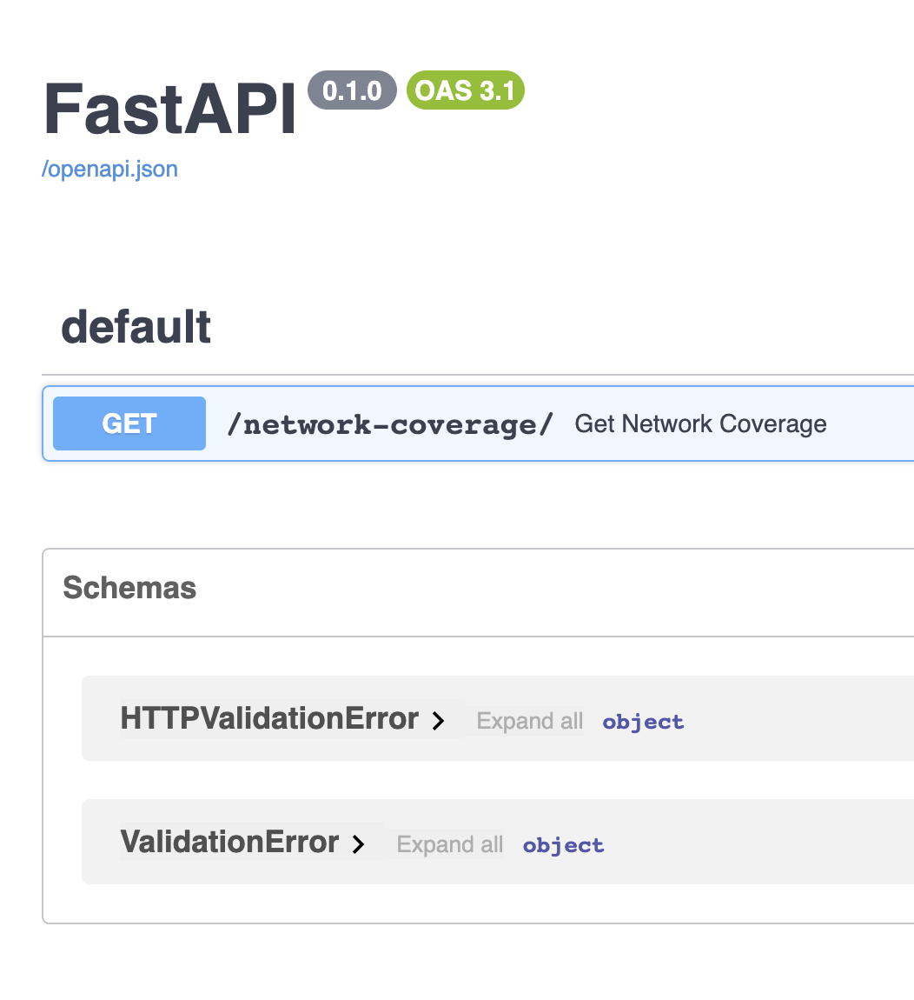

# Network Coverage API

The Network Coverage API is built using FastAPI and Poetry for dependency management. This API retrieves coordinates from an external address API, matches the coordinates with network coverage data stored in a CSV file, and provides coverage information for the nearest points.

## Features

- Fetch coordinates (longitude and latitude) from an address API.
- Match coordinates with network coverage data within a specified tolerance.
- Select the N closest points to a target longitude and latitude.
- Generate a response containing network coverage data for matched points.

## Getting Started

To get started with this API, follow these steps:

### Prerequisites

- Python 3.7+
- Poetry
- FastApi

### Installation

1. Clone this repository:
   ```bash
   git clone <repository_url>

Navigate to the project directory:
```cd network-coverage-api```

Install the project dependencies using Poetry:
```poetry install```

### Usage:
Run the FastAPI application:
poetry run uvicorn app.main:app --reload
```Access the API at http://localhost:8000/docs```



### Endpoints:

/network-coverage/: Retrieve network coverage data for a given address.


### CSV Data
The network coverage data is provided in a CSV file. Make sure to update this file with the latest network coverage information.

